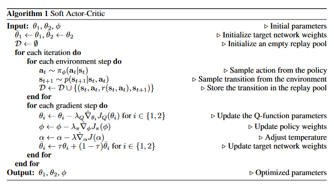

<!-- Allow this file to not have a first line heading -->
<!-- markdownlint-disable-file MD041 -->

<!-- inline html -->
<!-- markdownlint-disable-file MD033 -->

<div align="center">

# `🍒 emote`

**E**mbark's **Mo**dular **T**raining **E**ngine - a flexible framework for
reinforcement learning 
   
[](https://embark.dev)
[](https://discord.gg/dAuKfZS)
[](http://emote.readthedocs.io/?badge=latest)
[](https://pypi.python.org/pypi/emote/)
[](https://github.com/EmbarkStudios/emote/actions)

🚧 This project is very much **work in progress and not yet ready for production use.** 🚧

</div>


## What it does

Emote provides a way to build reusable components for creating reinforcement learning algorithms, and a
library of premade componenents built in this way. It is strongly inspired by the callback setup used
by Keras and FastAI.

As an example, let us see how the SAC, the Soft Actor Critic algorithm by
[Haarnoja et al.](https://arxiv.org/abs/1801.01290) can be written using Emote. The main algorithm in
SAC is given in [Soft Actor-Critic Algorithms and Applications](https://arxiv.org/abs/1812.05905) and
looks like this:

<div align="center">



</div>

Using the components provided with Emote, we can write this as

```python
env = DictGymWrapper(AsyncVectorEnv(10 * [HitTheMiddle]))
table = DictObsTable(spaces=env.dict_space, maxlen=1000)
memory_proxy = TableMemoryProxy(table)
dataloader = MemoryLoader(table, 100, 2, "batch_size")

q1 = QNet(2, 1)
q2 = QNet(2, 1)
policy = Policy(2, 1)
ln_alpha = torch.tensor(1.0, requires_grad=True)
agent_proxy = FeatureAgentProxy(policy)

callbacks = [
    QLoss(name="q1", q=q1, opt=Adam(q1.parameters(), lr=8e-3)),
    QLoss(name="q2", q=q2, opt=Adam(q2.parameters(), lr=8e-3)),
    PolicyLoss(pi=policy, ln_alpha=ln_alpha, q=q1, opt=Adam(policy.parameters())),
    AlphaLoss(pi=policy, ln_alpha=ln_alpha, opt=Adam([ln_alpha]), n_actions=1),
    QTarget(pi=policy, ln_alpha=ln_alpha, q1=q1, q2=q2),
    SimpleGymCollector(env, agent_proxy, memory_proxy, warmup_steps=500),
    FinalLossTestCheck([logged_cbs[2]], [10.0], 2000),
]

trainer = Trainer(callbacks, dataloader)
trainer.train()
```

Here each callback in the `callbacks` list is its own reusable class that can readily be used
for other similar algorithms. The callback classes themselves are very straight forward to write.
As an example, here is the `PolicyLoss` callback.

```python
class PolicyLoss(LossCallback):
    def __init__(
        self,
        *,
        pi: nn.Module,
        ln_alpha: torch.tensor,
        q: nn.Module,
        opt: optim.Optimizer,
        max_grad_norm: float = 10.0,
        name: str = "policy",
        data_group: str = "default",
    ):
        super().__init__(
            name=name,
            optimizer=opt,
            network=pi,
            max_grad_norm=max_grad_norm,
            data_group=data_group,
        )
        self.policy = pi
        self._ln_alpha = ln_alpha
        self.q1 = q
        self.q2 = q2

    def loss(self, observation):
        p_sample, logp_pi = self.policy(**observation)
        q_pi_min = self.q1(p_sample, **observation)
        # using reparameterization trick
        alpha = torch.exp(self._ln_alpha).detach()
        policy_loss = alpha * logp_pi - q_pi_min
        policy_loss = torch.mean(policy_loss)
        assert policy_loss.dim() == 0
        return policy_loss
```

## Installation

For installation and environment handling we use `poetry`. Install it from [here](https://python-poetry.org/). After `poetry` is set up, set up and activate the emote environment by running

```bash
poetry install
```

:warning: Due to bugs in Poetry you need to use one of the pre-release versions of the 1.2 minor version, until 1.2 is released.


## Contribution

[](../main/CODE_OF_CONDUCT.md)

We welcome community contributions to this project.

Please read our [Contributor Guide](CONTRIBUTING.md) for more information on how to get started.
Please also read our [Contributor Terms](CONTRIBUTING.md#contributor-terms) before you make any contributions.

Any contribution intentionally submitted for inclusion in an Embark Studios project, shall comply with the Rust standard licensing model (MIT OR Apache 2.0) and therefore be dual licensed as described below, without any additional terms or conditions:

### License

This contribution is dual licensed under EITHER OF

* Apache License, Version 2.0, ([LICENSE-APACHE](LICENSE-APACHE) or <http://www.apache.org/licenses/LICENSE-2.0>)
* MIT license ([LICENSE-MIT](LICENSE-MIT) or <http://opensource.org/licenses/MIT>)

at your option.

For clarity, "your" refers to Embark or any other licensee/user of the contribution.
