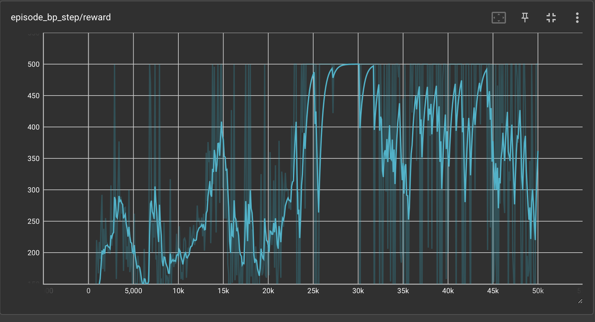

# 🔥 Getting Started

In the `/experiments` folder, example runs can be found for different Gymnasium environments.

For example, you can run the cartpole example using DQN with the following command:

```shell
pants run //experiments/gym/train_dqn_cartpole.py@resolve=base
```


This comes with a lot of predefined arguments, such as the learning rate, the amount of hidden layers, the batch size, etc. You can find all the arguments in the `experiments/gym/train_dqn_cartpole.py` file.

## 📊 Tensorboard

To visualize the training process, you can use Tensorboard. To do so, run the following command:

```shell
pants run //:tensorboard -- --logdir ./mllogs
```

This will start a Tensorboard server on `localhost:6006`. You can now open your browser and go to [http://localhost:6006](http://localhost:6006) to see the training process where you can see the rewards over time, the loss over time, etc.


